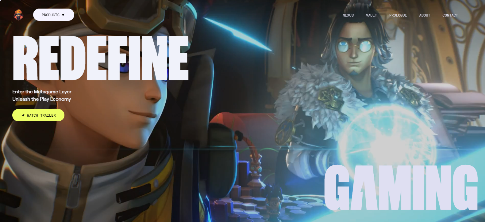

# Redefine Gaming 🎮🔥

## Overview
Build a visually captivating website inspired by **[Zentry](https://zentry.com/)**, featuring scroll-triggered animations, geometric transitions, and engaging video storytelling. Discover how to deliver a luxurious, modern feel, focusing on engaging UI/UX and smooth responsiveness, capturing the essence of what makes an Awwwards winner.

## 🎨 Preview


## 🚀 Features
✅ Scroll-Based Animations 🔄✨
Dynamic animations triggered by scrolling for a more engaging user experience.

✅ Clip Path Shaped Animations 🔺🎨
Unique geometric transitions using CSS clip-paths to create visually stunning effects.

✅ 3D Hover Effects 🕶️⚡
Interactive 3D transformations that respond to user interactions for a modern feel.

✅ Video Transitions 🎥🔄
Seamlessly integrated video elements to enhance storytelling and flow.

✅ Smooth UI/UX 🖌️🚀
Polished interfaces with buttery-smooth interactions for an intuitive user journey.

✅ Completely Responsive 📱💻🌍
Flawless adaptation across all devices, ensuring a consistent experience.

...and many more, including code architecture and reusability! 🛠️♻️

## 🖥️ Live Demo
Check out the live version of Redefine Gaming here: [Live Site](https://redefine-gaming-olive.vercel.app/)

---

## 🤸 Quick Start

Follow these steps to set up the project locally on your machine.

**Prerequisites**

Make sure you have the following installed on your machine:

- [Git](https://git-scm.com/)
- [Node.js](https://nodejs.org/en)
- [npm](https://www.npmjs.com/) (Node Package Manager)

**Cloning the Repository**

```bash
git clone https://github.com/Sankalp20Tiwari/redefineGaming.git
cd redefinegaming
```

**Installation**

Install the project dependencies using npm:

```bash
npm install
```

**Running the Project**

```bash
npm run dev
```

Open [http://localhost:5173](http://localhost:5173) in your browser to view the project.


---

## ⚙️ Tech Stack
- React.js
- GSAP (Greensock)
- Vite
- Tailwind CSS

---

## 📂 Project Structure
```
/apple
├──src/
    ├── components  # Reusable UI components
    ├──App.css      # CSS file
    ├──App.jsx      # Root component
    ├──index.css    # Custom CSS
    ├──main.jsx     # Entry point
├── public          # Static assets (icons, images, etc.)
└── package.json
└── tailwind.config.ts # Config files for tailwind
```

---

## 🤝 Contributing
We welcome contributions! To contribute:
1. **Fork** the repository
2. **Create a new branch** (`git checkout -b feature-name`)
3. **Commit your changes** (`git commit -m 'Add feature'`)
4. **Push to your branch** (`git push origin feature-name`)
5. Create a **Pull Request** 🚀

---


